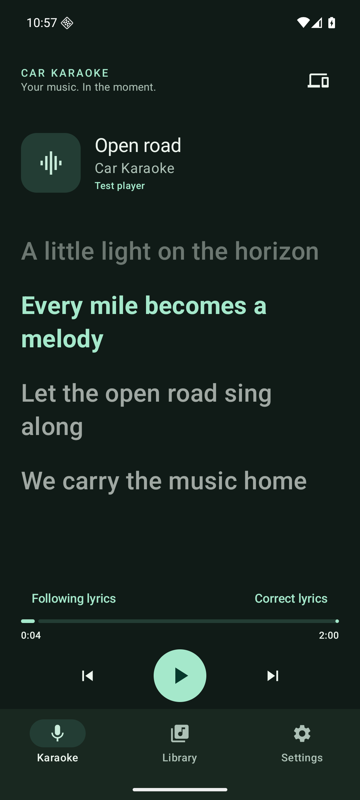
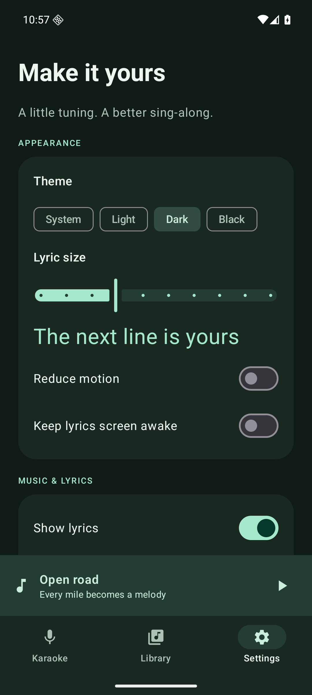

# Car Karaoke

Synchronized lyrics for your phone and Android Auto. A vehicle-independent fork of [AAMediaMate](https://github.com/gululu1235/AAMediaMate), built around reliable song matching and a clean Android experience.

- Moving multiline lyrics with the current line highlighted; enhanced LRC word timing when present.
- Shared phone/car song selection, lyrics and corrections, with optional car display-delay adjustment.
- Recording-aware cache and conservative matching; preview ambiguous results before selecting them.
- Clean Material 3 settings, light/dark/black themes, lyric size and reduced motion.
- LRC import, saved corrections, offline lyrics, backup and diagnostics.
- Signed GitHub releases with Obtainium updates. No account, subscription or billing.

## Install and updates

[**Add Car Karaoke to Obtainium**](https://apps.obtainium.imranr.dev/redirect?r=obtainium://app/%7B%22id%22%3A%22io.github.milankablar.carkaraoke%22%2C%22url%22%3A%22https%3A%2F%2Fgithub.com%2Fmilankablar%2Fcar-karaoke%22%2C%22author%22%3A%22milankablar%22%2C%22name%22%3A%22Car%20Karaoke%22%2C%22additionalSettings%22%3A%22%7B%5C%22includePrereleases%5C%22%3Afalse%2C%5C%22fallbackToOlderReleases%5C%22%3Atrue%2C%5C%22apkFilterRegEx%5C%22%3A%5C%22%5Ecar-karaoke-%5B0-9%5D%2B%5C%5C%5C%5C.%5B0-9%5D%2B%5C%5C%5C%5C.%5B0-9%5D%2B%5C%5C%5C%5C.apk%24%5C%22%2C%5C%22filterReleaseTitlesByRegEx%5C%22%3A%5C%22%5ECar%20Karaoke%20%5B0-9%5D%2B%5C%5C%5C%5C.%5B0-9%5D%2B%5C%5C%5C%5C.%5B0-9%5D%2B%24%5C%22%2C%5C%22versionExtractionRegEx%5C%22%3A%5C%22%5B0-9%5D%2B%5C%5C%5C%5C.%5B0-9%5D%2B%5C%5C%5C%5C.%5B0-9%5D%2B%5C%22%2C%5C%22matchGroupToUse%5C%22%3A%5C%22%240%5C%22%2C%5C%22versionDetection%5C%22%3Atrue%7D%22%7D) · [Download the APK](https://github.com/milankablar/car-karaoke/releases/latest)

1. Install [Obtainium](https://github.com/ImranR98/Obtainium/releases/latest) if needed.
2. Open the link above on your phone, confirm the import, then install Car Karaoke **through Obtainium**.
3. Grant installation permission when Android asks. Open Car Karaoke and enable music notification access.
4. Start a song in your music app. Connect Android Auto and open Car Karaoke → Live lyrics.


Obtainium tracks stable releases and selects the single Car Karaoke APK. Enable its background checks/updates if desired; Android controls scheduling and whether installation can be silent. [Setup and release details](docs/releases.md).

## Screens

 

Screenshots show original synthetic test lyrics on an Android emulator.

## Current status

Initial release. Automated regression checks and Android 16 emulator UI checks are available. Pixel 8 Pro/Android 17, Desktop Head Unit, physical Android Auto rendering, real music-app coexistence and a complete Obtainium update cycle still require acceptance testing. The first planned physical host is a Mazda CX-90; no vehicle-specific logic is used.

Android Auto owns the car layout and refresh behavior. The app exposes a moving three-line lyric destination and lyric display metadata, with a compatibility title mode. Word highlighting requires actual word timestamps; ordinary online LRC is line-timed and plain lyrics remain untimed.

## Development

Java 17, Android SDK 36, minimum Android 10 (API 29).

```sh
bash gradlew testDebugUnitTest lintDebug assembleDebug
bash gradlew connectedDebugAndroidTest
```

Release package: `io.github.milankablar.carkaraoke`. Debug builds use `.dev` and a separate signing identity.

[Architecture](docs/architecture.md) · [Test matrix](docs/testing.md) · [Release automation](docs/releases.md) · [Original implementation plan](docs/implementation-plan.md)

## Credits and license

Based on AAMediaMate v1.4.5 by gululu1235 and contributors; fork changes are documented in git history. LRCLIB supplies optional online lyric lookup. Lyrics belong to their respective rights holders and are not bundled with the app. Code is licensed under [Apache 2.0](LICENSE). See [NOTICE](NOTICE).
