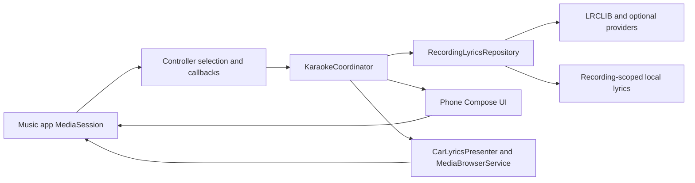

# Architecture

Car Karaoke retains AAMediaMate's single Android module and trusted media-browser bridge. The fork starts at upstream `288cca9b54891a250b3d1a7f8717ff8b73b22da6` (v1.4.5). The release package is `io.github.milankablar.carkaraoke`; development builds append `.dev`.

`KaraokeCoordinator` owns a StateFlow of song identity, lyric resolution, playback position and current line. It uses one monotonic playback clock anchored to source updates. A generation number and cancellation guard prevent A/B/A lookup races. Only one lookup runs for the recording regardless of how many surfaces collect state. A paused song holds its position; a seek reanchors it. Missing metadata waits for source callbacks rather than publishing unidentified lyrics.

`MediaBridgeSessionManager.acquire/relinquish` accounts for visible phone and connected car owners. The source controller is pinned by session token, with explicit package selection retained through session replacement. Active-session and notification events trigger debounced refreshes; source metadata/playback callbacks reanchor the clock.

`TrackIdentity` includes source package, media ID, normalized title/artist/album, and duration. `v3_` cache keys separate recordings. Unknown duration cannot establish an automatic match. LRCLIB responses retain title, artist, album, duration and provenance; optional anonymous providers produce candidates requiring a user choice. Cleanup changes search queries, but automatic validation still uses the original identity conservatively.

`RecordingLyricsRepository` stores bounded UTF-8 LRC and JSON metadata under the existing lyrics storage lock. Metadata includes a content hash, provenance, recording identity, manual selection, offset and fetch time. Atomic individual file replacement plus hash validation prevents an interrupted pair of writes from being trusted. Storage revision checks protect edits/deletion against pending network answers. Manual lyrics stay pinned; automatic entries expire after 30 days; misses last an hour in memory; network errors are not negative-cached. Validated stored lyrics work offline. Legacy title/artist entries need explicit selection for a recording.

`EnhancedLrcParser` preserves repeated timestamps, blank/instrumental intervals, offsets and real word timestamps. It never estimates word timing from a line's length. Per-recording positive offsets delay both displays. The car's additional display offset does not mutate shared song timing.

Phone presentation is Compose Material 3 with Karaoke/Library/Settings navigation. `CarLyricsPresenter` derives the car window from the same state. The browser exposes Live lyrics and Music apps; car refreshes are coalesced at 300 ms and lyrics are also published in display metadata. Compatibility mode puts lyrics into the displayed title, while source identity remains unchanged. Car rendering is host-controlled and needs DHU/head-unit validation.

Legacy `LyricDisplayManager`, `LyricCache` and provider implementations remain for the existing editor/library tools and their regression tests. The live bridge no longer starts the old lyric-display engine. Billing has been removed. Release builds shrink unused dependency code/resources while retaining app/provider models and OpenCC reflection entry points. Media3 migration and multiple Gradle modules are deliberately deferred.
