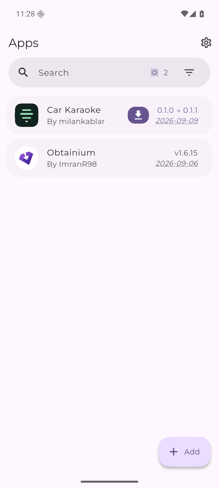
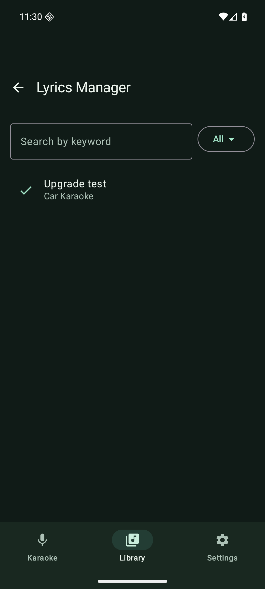

# Distribution verification — 2026-09-10 UTC

The public fork is [milankablar/car-karaoke](https://github.com/milankablar/car-karaoke). Both tagged releases were built and published by GitHub Actions, with tests, lint, APK identity checks, certificate verification and checksums. No APK was manually substituted into a release.

| Release | versionCode | Source commit | Workflow |
|---|---:|---|---|
| 0.1.0 | 1 | `4db7f70341fac68205e93ebc036fc362614a9570` | [Passed](https://github.com/milankablar/car-karaoke/actions/runs/34436191107) |
| 0.1.1 | 2 | `090f74e33fd08ee47ad57d931ca6bc1a021634ed` | [Passed](https://github.com/milankablar/car-karaoke/actions/runs/34436866435) |

Both APKs use package `io.github.milankablar.carkaraoke` and signing certificate SHA-256:

`05b222bd86481aec26598681e1486c6c722e32332941f887acfe84d1934cae32`

Downloaded release files were independently checked against their published hashes and certificate metadata. The 0.1.1 APK is 5,740,722 bytes.

## Obtainium test

Device: isolated Android 16/API 36 ARM64 emulator. Obtainium: official v1.6.15 ARM64 APK, download checksum verified.

1. Imported the generated app configuration using its `obtainium://app/` deep link and confirmed the exact repository/package.
2. Obtainium selected the single `car-karaoke-0.1.0.apk` asset. Granted its install-source permission, then installed through Obtainium's normal installer flow.
3. Android reported versionName 0.1.0, versionCode 1, and both installer/initiating package `dev.imranr.obtainium`.
4. Selected the dark theme in the released app. Seeded an original synthetic lyric fixture, opened it in the release app's library/editor, shifted its timestamps by 500 ms and saved it through the editor. Its manual-selection flag and per-song 250 ms offset were retained.
5. Published 0.1.1 through the same workflow. A manual Obtainium refresh detected **0.1.0 → 0.1.1** and selected the single matching APK.
6. Requested the update in Obtainium. Android reported versionName 0.1.1, versionCode 2, with Obtainium still the installer.
7. Compared the saved LRC and metadata files: both remained byte-for-byte identical across the update. Reopened the library, confirmed the saved song appeared, and verified the dark theme remained selected/rendered.
8. Exercised the 0.1.1 in-app Obtainium setup shortcut; it opened Obtainium's import confirmation.

 

This verifies manual refresh, release selection, installation and a real signed update in the emulator. It does not establish scheduled background-install timing, Pixel 8 Pro/Android 17 behavior, physical Android Auto rendering, or long screen-locked playback. Those remain in the [device test matrix](testing.md).
