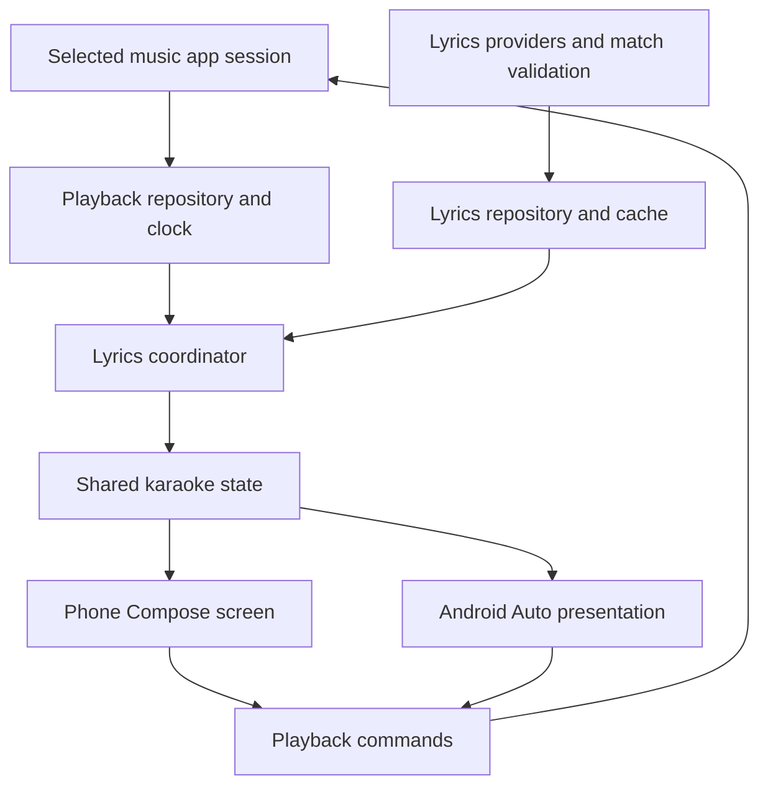

# Car Karaoke implementation plan

Prepared 2026-09-09. This is the implementation plan; repository creation, code changes, signing-key creation, publishing, and phone installation are future steps.

## Outcome and decisions

Build **Car Karaoke**, a vehicle-independent Android companion that follows the music app selected by the user, finds the correct recording's lyrics, and displays synchronized lines on the phone and Android Auto. The first physical test setup is the user's **Pixel 8 Pro running Android 17**, connected to a **Mazda CX-90**. No Mazda-specific APIs, layouts, package checks, or timing assumptions belong in the product.

The phone app must look clean and polished throughout, including a redesigned settings experience. Phone and Android Auto must be usable simultaneously for lyrics/karaoke, sharing the selected song, timing, corrections, and playback controls. This is shared state within the Android app; it needs no account or cloud synchronization.

- Start from **gululu1235/AAMediaMate v1.4.5**, commit `288cca9b54891a250b3d1a7f8717ff8b73b22da6`.
- Proposed public GitHub fork: **milankablar/car-karaoke**; display name **Car Karaoke**.
- Proposed application ID and Kotlin namespace: **io.github.milankablar.carkaraoke**; development app ID adds `.dev`.
- Keep Apache-2.0 licensing and upstream attribution. Retain upstream history and a read-only-in-practice `upstream` remote.
- Primary distribution: **signed GitHub Releases + Obtainium**. No store submission or self-hosted app repository is required.
- Build line-synchronized karaoke first. The data model will support real word timestamps, but online word-timing coverage is a separate capability and must not determine whether basic lyrics work.
- Keep the existing media-browser integration initially. Do not combine the first release with a wholesale Media3 migration or a rewrite into many Gradle modules.

## Inspection and baseline

Reviewed the manifest/build configuration, media browser service and notification listener, controller selection, session manager, transport callbacks, client validation, metadata extraction, all three lyric providers, HTTP cancellation, cache/storage/repository, LRC parsing and synchronization, phone navigation/editor/manual search, settings, diagnostics, backup/restore, and representative lifecycle/timing/storage/transport tests. Also inspected the upstream release notes and open issues, and Auto Lyrics' implementation as a reference for karaoke presentation.

The upstream source has **25 unit-test source files**, including one example test. There is no checked-in `.github` workflow directory at this revision. Test-file presence is not a claim that tests pass.

Local readiness confirmed:

- `gh` is installed and authenticated as `milankablar`; the proposed repository was not found.
- Homebrew Java 17 is usable. macOS's `java_home` discovery does not find it, so commands should set the Homebrew JDK path explicitly.
- Two SDK installations exist: `/Users/milan/Projects/android-sdk` has API 34; `/Users/milan/Library/Android/sdk` has API 36/36.1. Standardize this project on the latter.
- The source uses compile/target SDK 36, minimum SDK 29, AGP 8.9.1, Gradle 8.11.1, and Kotlin 2.0.21. Keep minimum Android 10 initially; test Android 17 explicitly. Audit tool compatibility and pin a supported combination before the first release.
- Baseline command: `JAVA_HOME=/opt/homebrew/opt/openjdk@17/libexec/openjdk.jdk/Contents/Home ANDROID_HOME=/Users/milan/Library/Android/sdk bash ./gradlew testDebugUnitTest assembleDebug lintDebug --console=plain`.
- The baseline run automatically installed the required Android Build Tools 35.0.0 into the selected SDK under its existing accepted license. It also emitted an SDK XML tooling-version warning.
- Baseline result: **BUILD SUCCESSFUL**. **94 tests passed, zero failures/errors/skips**; debug APK assembly and lint completed. Lint reported **87 warnings and one informational item, zero errors**. Major categories include dependency recommendations, unused resources, version-catalog usage, and several static context references. Review correctness-relevant warnings first; do not update every dependency just to silence suggestions. The debug APK is 57,967,108 bytes, which is not a release-size measurement. No phone/head-unit testing has been performed.

## Findings that drive the work

| Priority | Observed code behavior | Planned improvement |
|---|---|---|
| P0 | LRCLIB receives duration but sends only title/artist; it returns lyric text without checking response identity. Other providers also return strings, losing identity/provenance. | Return typed candidates with provider ID, matched title/artist/album/duration, timing type, and validation outcome. Validate before display or caching. |
| P0 | Cache identity is title + artist; album, recording length, and provider identity are absent. Successful cache entries have no expiry. | Versioned recording-aware cache, provider provenance, manual selection pinning, explicit refresh, and separate miss/error handling. |
| P0 | Refresh selects the first playing/buffering controller, while transport lookup later selects the first controller matching a package. Explicit selection is not durably pinned to a session. | Track selected source/session consistently; add stable Auto-select and explicitly selected modes; test multiple sessions and helper-app loops. |
| P1 | Every `updateFromMediaInfo` restores base metadata and starts lyric work again, including same-track refreshes. | Separate track changes, clock changes, artwork changes, and display preferences. Avoid unnecessary fetch cancellation, cache reads, and metadata flicker. |
| P1 | The stale-position correction clock advances at 1x regardless of playback speed. Rewind/forward use the raw reported position. | One monotonic playback clock used for lyrics and relative seek calculations; handle rate, pause, buffering, seek, stale state, and bounds consistently. |
| P1 | Phone state depends on one callback slot in the session manager. Lyrics work starts through the car service. | Shared observable state with explicit ownership while the phone screen or car service is active; phone karaoke must work without a car connection. |
| P1 | `hasNotificationAccess` uses substring matching on enabled component names. The `.dev` package can make that misleading for the release package. | Check the exact enabled listener component and handle permission loss/regrant. |
| P1 | Current lyric display writes lyrics into media title/artist fields; there is no dedicated multiline car lyric screen. | Separate the real track identity from display text; add phone renderer and a tested car lyrics destination while retaining compatible playback controls. |
| P1 | Main activity has many navigation booleans; settings use stacked full-width buttons and inconsistent information density; manual search owns asynchronous work in the composable. | Redesign the full phone shell and settings with a coherent Compose design system, typed destinations, focused ViewModels, and concise settings rows. Preserve existing settings behavior during migration. |
| P2 | All providers default enabled, including providers requiring missing credentials or a server URL. | LRCLIB enabled by default; optional providers enabled only after configuration. Show actionable provider errors. |
| P2 | Google Play Billing and donation UI are wired into startup. | Remove billing dependency, permission, startup connection, and billing-only UI/tests for this fork; retain upstream credit. |
| P2 | System backup XML files remain templates even though settings can contain provider credentials. | Explicit backup exclusions for credentials, diagnostics, and temporary restore state; retain tested user-directed lyric backup/import. |
| P2 | There is no CI or release workflow in the inspected revision. | Establish checks first; add permanent signing, deterministic versioning, verified release assets, and Obtainium onboarding. |

Preserve existing safeguards: v1.4.5 already has request-generation checks, cancellable HTTP, monotonic line timing, atomic file replacement, edit/delete protection against downloads, bounded network payloads, restore validation/rollback, caller validation, and diagnostics redaction. Extend their tests rather than reimplementing them unnecessarily.

The user's wrong-song observation is **not yet reproduced**. The app version, enabled lyric provider, source music app, and example track are still unknown. AAMediaMate's v1.4.5 release notes explicitly describe fixes for stale lyric requests and track position carried from an earlier song. Start from that version and distinguish a remaining matching defect from behavior already fixed upstream. [Release notes](https://github.com/gululu1235/AAMediaMate/releases/tag/v1.4.5)

## Phase 1 — Create the fork and establish a reproducible baseline

1. Recheck whether `milankablar/car-karaoke` already exists before making changes. If it exists, inspect its origin and preserve its work.
2. Use `gh repo fork gululu1235/AAMediaMate --fork-name car-karaoke --clone=false`, then clone our fork into `/Users/milan/Projects/car-karaoke`.
3. Set `origin` to our repository, `upstream` to AAMediaMate, and `gh repo set-default milankablar/car-karaoke`. Use explicit `--repo` on remote mutations so releases/issues never target upstream accidentally.
4. Record the exact starting commit and initial test/build findings. Preserve history; do not synchronize upstream destructively over our branch later.
5. Rename the app, namespace/package references, settings labels, diagnostic branding, project name, launcher icons, and relevant translated strings. Keep `LICENSE` and add clear attribution and a description of the fork's changes. Update inherited agent guidance to describe this project's new identity.
6. Remove billing. Keep existing playback controls, editor, cache management, and backup tools. Keep development and release apps separately installable.
7. Add a small `version.properties` containing explicit `versionName` and `versionCode`. Values are committed; no date- or run-number-based versions. Start the new app's own sequence at 0.1.0/code 1.
8. Add build instructions, contribution notes, issue template with player/Android/AA versions and repro steps, and this plan under `docs/implementation-plan.md`.
9. Add `.github/workflows/ci.yml`: Gradle wrapper verification, unit tests, debug assembly, and lint on pull requests and pushes. Pin action revisions and Java/tool versions. Upload reports and development APKs as Actions artifacts. Only the later release workflow publishes release assets.

Exit condition: renamed app builds and the baseline test/lint problems are resolved or precisely documented before new functionality; CI runs successfully on our fork.

## Phase 2 — Prove the car display approach early

Use a small synthetic lyric fixture and the existing media service to prototype a **Lyrics** browse destination showing previous/current/next lines. Keep a separate **Players** destination and preserve play/pause/skip controls. A three-line moving window is the initial car target; test longer lines, Unicode, font scaling, rotary focus, and different viewport sizes.

The phone can use a fully animated Compose list. Android Auto renders the media UI on the host; browser metadata is not a custom drawing surface. The car prototype must establish whether row refreshes, focus retention, and the visible line count work on the Pixel/CX-90 combination and Desktop Head Unit. Throttle car refreshes to actual line/window changes and measure responsiveness rather than sending animation-frame updates.

If host-rendered rows work, keep that implementation for broad compatibility. If they do not meet the desired experience, record the failing behavior and evaluate the current Car App Library media templates in an isolated prototype. Those templates are still host-constrained and need their own installation/compatibility checks. Do not claim that they guarantee smooth karaoke scrolling or treat a phone-only implementation as completion of the car requirement. [Android media architecture](https://developer.android.com/training/cars/media), [templated media](https://developer.android.com/training/cars/apps/media)

Exit condition: a concrete demonstrated car display strategy and an explicit description of the animation the host supports. This gate occurs before extensive visual polish.

## Phase 3 — Stabilize playback and lyric ownership

Introduce focused interfaces/classes within the existing app module:

- `PlaybackRepository`: selected controller token, source package, track metadata, and playback snapshots. Subscribe to active-session changes as well as notifications and controller callbacks.
- `TrackIdentity`: source/media ID when available, original and normalized metadata, album/version, duration. Do not treat artwork updates or completion of missing metadata as a new song automatically.
- `PlaybackClock`: position + monotonic observation time + playback state/rate. Paused/buffering states do not advance; explicit seeks reset the anchor; unknown duration is handled separately from zero position.
- `LyricsRepository`: resolved content, cache, manual overrides, candidates, and status.
- `LyricsCoordinator`: consumes track/clock changes and exposes immutable `StateFlow<KaraokeState>` for both renderers. Own request generations; fetch only on identity change or explicit refresh.
- `PhoneKaraokeViewModel` and car presentation adapter: render shared state and send commands back through the selected source.

Use a lightweight constructor-injected dependency container; avoid adding a large DI framework just for this work. Keep network/storage off the main thread. Scope callbacks and jobs to the app components using them, unregister them predictably, and make phone-only karaoke independent of Android Auto startup. Test Android 17 background behavior before adding any persistent foreground service; the app must not seize audio focus or pretend to play silent audio merely to remain alive.

Both interfaces collect the same state rather than starting their own lyric fetches or timing engines. Playback commands from either interface go through one command path and then reflect the source player's authoritative response. The active lyric selection, imported/corrected lyrics, and per-song timing correction update both. Phone scroll position, theme, text size, and optional surface-latency adjustment are presentation preferences and need not be identical to the car. Closing the phone UI must not stop a connected car session; disconnecting the car must not stop a visible phone karaoke session. Manual browsing on one surface must not scroll the other away from the active line.

Pin explicit player selection until it becomes unavailable or the user chooses Auto-select. Avoid feeding the fork's own session, an installed AAMediaMate session, or another recognized lyric bridge back into itself. Handle session replacement within one package and concurrent playback predictably. Advertise only playback actions supported by the selected source.

Exit condition: rapid track changes, same-track metadata changes, pause/resume, seeks, source changes, service recreation, and permission changes never produce cross-track writes in deterministic tests. The phone screen works without a car connection.

## Phase 4 — Correct matching, cache identity, and recovery

1. Change provider results from raw strings to candidates carrying original response identity, duration, timing type, provider identifier, and content. Keep source-track identity separate from provider-record identity.
2. LRCLIB: exact lookup with available title/artist/album/duration (convert milliseconds to seconds), followed by structured search. Rank using conservative title/artist normalization, recording qualifiers, duration, and album as supporting evidence. Do not erase meaningful live/remix/acoustic labels during cleanup.
3. Require a clear match before automatic selection. Treat ambiguous candidates as `NeedsSelection`, not a success. Providers that return text without identity should be marked unverified and should not silently beat a validated match.
4. Start with synthetic fixtures for same titles/different artists, multiple recordings, featured artists, punctuation, Unicode, missing album, missing duration, bad provider data, and delayed responses. Tune duration tolerances against those cases and real examples; do not invent a confidence percentage without calibration.
5. Add phone actions: **Wrong lyrics**, **Choose another match**, **Retry**, **Import LRC**, and per-recording timing adjustment. Show candidate title/artist/duration/provider and a preview before saving a selection.
6. Introduce a cache schema version with recording fingerprint, provider record ID, provenance, original content, fetched time, and manual selection/edit state. Keep atomic writes and in-flight edit protection. Preserve user edits indefinitely until changed by the user; revalidate auto-fetched entries according to a defined policy.
7. Old title/artist cache entries become legacy/unverified candidates. Importing upstream backups must never silently certify those entries as the correct recording. Preserve edited text and allow reassociation.
8. Distinguish no lyrics, instrumental, plain lyrics, malformed response, timeout/offline, and server failure. Retry transient failures with a bounded policy; no permanent negative cache for network errors. Pause retries while unavailable and offer an explicit retry.
9. Extend local diagnostics with source identity, request generation, provider result identity, acceptance/rejection reason, cache origin, and timing corrections. Do not log entire lyrics or credentials; user exports remain deliberate.

Exit condition: every displayed/cached automatic match has validated provenance; a stale result cannot cross tracks; a user correction survives app restart and subsequent downloads. Reproduce and fix the user's example when supplied, without claiming all provider-data mistakes can be eliminated.

## Phase 5 — Redesign the phone app and deliver synchronized karaoke

Phone design system and navigation:

- Use a coherent Material 3 Compose visual language: restrained colors, consistent typography and spacing, compact grouped settings rows, clear section labels, and accessible touch targets. Default to the system light/dark theme with an optional dark/AMOLED presentation; use album-derived accents only where text contrast remains readable.
- Main navigation: **Karaoke**, **Library**, **Settings**. The active source selector belongs on the karaoke screen; a compact now-playing strip on Library/Settings returns to the current lyrics.
- Design the Karaoke and Settings screens first using synthetic track/lyric content; review their rendered appearance before converting every secondary screen. Carry the same components through candidate search, editing, import, and backup screens.
- Replace the current collection of navigation booleans with explicit destinations/back-stack state. Preserve draft editing, scroll restoration, and unsaved-change handling across navigation and rotation.
- Group Settings into **Appearance**, **Lyrics & timing**, **Music apps & controls**, **Android Auto**, **Storage & backup**, and **Updates & about**. Provider endpoints, cleanup regexes, and diagnostic tools live under clearly labeled advanced subpages rather than dominating the main screen.
- Give settings short labels plus the current value or a useful one-line explanation. Use switches only for true on/off settings, row navigation for detailed pages, and bottom sheets where a short choice list benefits from them. Make timing adjustments previewable, and distinguish a shared song correction from a car display offset in plain language.
- Include designed loading, no-media, no-lyrics, ambiguous-match, offline, and permission-needed states. Put the relevant recovery action next to the problem. Obtainium setup lives under Updates & about with a clear indication that updates are managed externally.
- Use local UI previews and screenshots for visual checks: normal/large fonts, light/dark, portrait/landscape, narrow displays, and edge-to-edge system insets on Android 17. Confirm the screen is readable without depending on color alone.

Phone:

- Dedicated Now Playing/Karaoke screen with a fixed track header, prominent current line, dimmed prior line, and upcoming lines.
- Smoothly scroll the current line toward the center on line changes. Retain readable wrapping, portrait/landscape layouts, accessible contrast, and reduced-motion behavior.
- While the user manually scrolls, temporarily stop following and offer **Back to current line**. Pause holds the active line; seek jumps to the correct line without playing through intervening animations.
- Show instrumental gaps without prematurely highlighting the first lyric. Plain untimed lyrics remain scrollable text rather than being assigned fictional timing.

Android Auto:

- Implement the car layout proven in Phase 2 using the same lyric state and selected controller.
- Moving previous/current/next window; clear current-line emphasis within supported host formatting.
- Preserve player selection, artwork, and basic controls. Do not assume a fixed screen size, touch input, or Mazda behavior.
- Update only changed presentation fields and affected browse nodes. Verify that focus and controls survive window changes and reconnects. Retain a simpler compatible display as a user-selectable fallback, not a substitute for completing the multiline goal.

Timing model:

- Use integer milliseconds for lines and optional words; preserve original LRC for editing/export.
- Support existing LRC forms, repeated leading timestamps, blank lines, metadata tags, file offsets, and enhanced LRC word tags.
- Highlight words only where actual timestamps exist. First prove word highlighting with imported enhanced LRC fixtures. Online word-level providers can be added later through the same validated provider contract.
- Keep per-recording lyric correction distinct from a phone/car display latency offset. Define and test the sign convention to prevent double adjustment.

Exit condition: the phone app has a consistent, polished shell and settings experience, and synchronized multiline display works simultaneously on phone and the proven car surface, including pause, seek, repeat, corrections, and track transitions. Lack of word timing falls back cleanly to line highlighting.

## Phase 6 — Configure signed GitHub releases with `gh`

The setup is automated from the CLI once implementation begins:

1. Generate a new release keystore outside the checkout with restrictive permissions. Store a recoverable backup and record its certificate fingerprint. Never reuse the upstream developer's identity or a debug key.
2. Use `gh secret set --repo milankablar/car-karaoke` with data supplied through standard input to configure `ANDROID_KEYSTORE_BASE64`, `ANDROID_KEYSTORE_PASSWORD`, `ANDROID_KEY_ALIAS`, and `ANDROID_KEY_PASSWORD`. Do not print values or put them in command arguments, source, logs, or APK assets. Base64 is transport encoding, not encryption.
3. Create `.github/workflows/release.yml`. Trigger on our own release tags such as `car-karaoke-v0.1.0`, avoiding upstream's existing `v*` tags. Release display names remain `0.1.0`, matching Android's version name. Validate Obtainium's source-version extraction explicitly.
4. Only release commits on our main branch with a matching committed version may publish. Check the numeric version code against prior Car Karaoke releases; reject reused or lower codes and duplicate releases. Never move/reuse a published tag or overwrite an existing APK under the same version.
5. Run tests and release lint, build the release APK, sign it, and verify package ID, version name/code, certificate fingerprint, and absence of debug/test flags using Android tooling.
6. Use minimal workflow permissions. PR checks get no signing secrets; only the trusted release job gets signing material and release write access. Pin third-party action revisions and validate the Gradle wrapper checksum.
7. Build one universal APK initially to avoid manual architecture selection in Obtainium. Use a consistent asset name such as `car-karaoke-0.1.0.apk` plus `SHA256SUMS.txt`. Keep debug artifacts out of public release assets.
8. Create a draft release with `gh release create`, attach the verified artifacts and notes, then publish it after asset checks pass. Stable releases become Latest; prereleases do not. All publishing steps execute explicitly in that job; do not depend on another workflow starting from a tag created with `GITHUB_TOKEN`.
9. Add `scripts/release.sh <version>` to verify a clean checkout, committed version values, remote main commit, and prior checks; create/push the namespaced tag and watch the release run with `gh run watch`. A failed release stops publishing. Fix-forward releases use a new version code rather than promising Android downgrades.
10. Use `gh` to configure the repository description, issues, Actions, and branch protections supported by the account. Verify settings rather than assuming all protection features are available. Future upstream updates go through ordinary reviewed branches.

Checks workflow configuration can be added in Phase 1. Prepare signing/release infrastructure early enough to distribute prototypes; the first durable release is published after the corresponding functionality passes its acceptance checks. [GitHub CLI fork behavior](https://cli.github.com/manual/gh_repo_fork), [GitHub secrets](https://docs.github.com/en/actions/how-tos/write-workflows/choose-what-workflows-do/use-secrets)

## Phase 7 — Make Obtainium setup nearly one tap

Obtainium is a client on the phone, not a service we publish the app to. No account registration or listing approval is needed for it to follow our public GitHub releases.

Generate `distribution/obtainium.json` from the actual app ID/repository/version convention and generate a matching encoded import link, HTTPS redirect link, and QR code. Validate the current export schema before setting optional fields. The configuration must select our GitHub repository, stable releases by default, and exactly one APK using `^car-karaoke-[0-9]+\.[0-9]+\.[0-9]+\.apk$`. Verify how release display names and namespaced tags resolve to the installed version. [Deep-link format](https://wiki.obtainium.imranr.dev/deep_links/), [source filters](https://wiki.obtainium.imranr.dev/sources/)

Add an **Add to Obtainium** link and QR to the README and installation instructions; include a direct APK fallback. The import link carries the configuration, so it need not depend on a hosted config fetch. Keep the JSON as a reviewable/exportable companion file. No GitHub token is included in the app or import link.

Phone setup:

1. Install Obtainium from its official release if needed.
2. Open our import link or scan the QR, confirm the import, and let **Obtainium perform the first Car Karaoke release installation**.
3. Complete Android's install-source permission and Car Karaoke's exact notification-listener permission. If Android presents a restricted-settings gate for this install, document the actual supported phone flow rather than pretending CI can grant it.
4. Check Obtainium's background checks/updates and notification settings. Android 17 satisfies its Android 12+ silent-update OS prerequisite, but other conditions and OS scheduling still apply.
5. Enable Android Auto's documented media-app sideload test setting if needed and verify discovery after reconnecting. The ability to install an APK does not alone prove the car host will display it.

I can automate the repo, configuration, link/QR generation, signing, and releases. GitHub CLI cannot grant phone permissions or confirm the Obtainium import. If the phone is later connected through an authorized device-control channel, assist with setup there; otherwise supply the short on-device steps. Avoid making ADB the normal release installer, because Obtainium's documented silent-update conditions include the current app having been installed by Obtainium. [Background update conditions](https://wiki.obtainium.imranr.dev/app_tracking/), [Android Auto testing](https://developer.android.com/training/cars/testing)

Exit condition: Obtainium installs one signed release, detects a second higher-version release, and updates it while retaining settings, cached/manual lyrics, and signing identity. Confirm the installed Android version and actual application behavior, not merely a successful GitHub job or an Obtainium notification. Test a manual refresh first, then a scheduled background check.

## Phase 8 — Test matrix and release milestones

| Layer | Required evidence |
|---|---|
| Deterministic unit tests | Out-of-order A/B/C lookups; switch away and back to A; session replacement; simultaneous players; missing/split metadata; same-title recordings; bad provider response; cache migration; manual override protection; offset/rate/seek math; LRC/word parsing. |
| Integration tests | HTTP cancellation/errors with mock responses; storage failure; backup restore and interrupted restore; permission disconnect/reconnect; repository state shared by phone and car. |
| Phone UI | Pixel 8 Pro/Android 17 first; redesigned settings/navigation, light/dark/AMOLED, large text, contrast/touch targets, empty/error states, rotation, reduced motion, scroll/follow, pause/seek, local import, correction flow, airplane mode, process recreation, screen lock/unlock. |
| Simultaneous phone/car | Same track and lyric content on both; phone seek reflected in car and car controls reflected on phone; shared correction and offset changes; no duplicate fetches; independent manual scrolling; neither surface's dismissal tears down the other. |
| Android Auto | Desktop Head Unit at multiple sizes; CX-90 as first physical host; touch/rotary where available; full/split display; repeated track changes; native-player coexistence; wired and wireless if available; disconnect/reconnect; host refresh/focus behavior. |
| Background | At least a continuous screen-locked listening session, reconnect, permission recovery, and battery/timing observation on Android 17. Investigate stalls before adding persistent services or blanket battery exemptions. |
| Compatibility | Retain min API 29; emulator smoke tests on API 29 and a recent Android version, then Android 17 physical tests. Add further host results as available; do not claim all vehicles are verified. |
| Distribution | Clean release build; signature/package/version verification; one APK selected; stable/prerelease separation; first install and subsequent update through Obtainium; preserved app data. |

The primary music app and the original wrong-lyrics example remain to be supplied. Begin the generic compatibility matrix with Spotify, YouTube Music, and a local player exposing Android MediaSession; these are test targets, not claims that they have already passed.

Suggested milestones:

1. **Foundation/prototype:** branded fork, CI, baseline behavior, early car multiline demonstration, signing infrastructure prepared.
2. **Reliability:** stable selected session, validated matching, recording-aware cache, correction UI, shared state.
3. **Phone redesign and karaoke:** clean app navigation/settings, multiline phone/car rendering, simultaneous shared playback/lyrics, movement appropriate to each surface, timing controls, enhanced LRC import.
4. **Distribution:** first stable signed release and Obtainium onboarding, then a legitimate follow-up release proving updates preserve data.
5. **Later:** validated online word-timing providers, optional translation/transliteration, additional head-unit testing, and architecture upgrades justified by measured needs.

Completion means the phone and car experience meet the demonstrated karaoke target and a real Obtainium update succeeds. It does not mean only creating a repository, producing a debug APK, or adding a release workflow file.

## Source anchors

- [AAMediaMate source at the inspected revision](https://github.com/gululu1235/AAMediaMate/tree/288cca9b54891a250b3d1a7f8717ff8b73b22da6)
- [Controller selection](https://github.com/gululu1235/AAMediaMate/blob/288cca9b54891a250b3d1a7f8717ff8b73b22da6/app/src/main/java/com/gululu/aamediamate/MediaControllerManager.kt)
- [Session update and timing behavior](https://github.com/gululu1235/AAMediaMate/blob/288cca9b54891a250b3d1a7f8717ff8b73b22da6/app/src/main/java/com/gululu/aamediamate/MediaBridgeSessionManager.kt)
- [LRCLIB lookup](https://github.com/gululu1235/AAMediaMate/blob/288cca9b54891a250b3d1a7f8717ff8b73b22da6/app/src/main/java/com/gululu/aamediamate/lyrics/providers/LRCLibProvider.kt)
- [Cache](https://github.com/gululu1235/AAMediaMate/blob/288cca9b54891a250b3d1a7f8717ff8b73b22da6/app/src/main/java/com/gululu/aamediamate/lyrics/LyricCache.kt)
- [Existing lifecycle regression tests](https://github.com/gululu1235/AAMediaMate/blob/288cca9b54891a250b3d1a7f8717ff8b73b22da6/app/src/test/java/com/gululu/aamediamate/LyricDisplayLifecycleTest.kt)
- [Open native-player coexistence report; user report, not independently reproduced](https://github.com/gululu1235/AAMediaMate/issues/17)
- [Auto Lyrics car-rendering reference](https://github.com/GitUpGitUp/auto-lyrics/blob/854c5fa032632a5703349dacb7ae91aa5e19f3d8/app/src/main/java/com/autolyrics/auto/LyricsBrowserService.kt)
